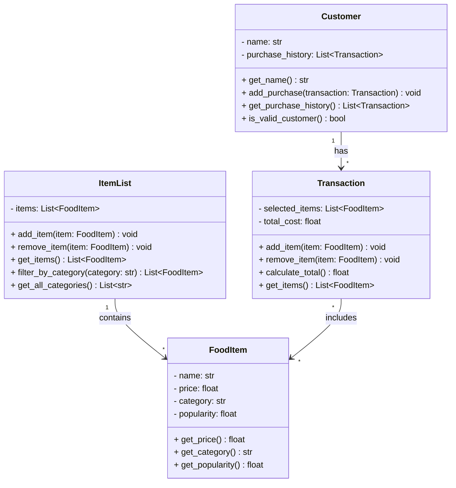

# ByteBites UML Class Diagram

```mermaid
classDiagram
    class FoodItem {
        - name: str
        - price: float
        - category: str
        - popularity: float
        + get_price() float
        + get_category() str
        + get_popularity() float
    }

    class ItemList {
        - items: List~FoodItem~
        + add_item(item: FoodItem) void
        + remove_item(item: FoodItem) void
        + get_items() List~FoodItem~
        + filter_by_category(category: str) List~FoodItem~
        + get_all_categories() List~str~
    }

    class Transaction {
        - selected_items: List~FoodItem~
        - total_cost: float
        + add_item(item: FoodItem) void
        + remove_item(item: FoodItem) void
        + calculate_total() float
        + get_items() List~FoodItem~
    }

    class Customer {
        - name: str
        - purchase_history: List~Transaction~
        + get_name() str
        + add_purchase(transaction: Transaction) void
        + get_purchase_history() List~Transaction~
        + is_valid_customer() bool
    }

    ItemList "1" --> "*" FoodItem : contains
    Transaction "*" --> "*" FoodItem : includes
    Customer "1" --> "*" Transaction : has
```

## Class Relationships

- **ItemList** contains many **FoodItem**s
- **Transaction** includes multiple **FoodItem**s
- **Customer** has multiple **Transaction**s
